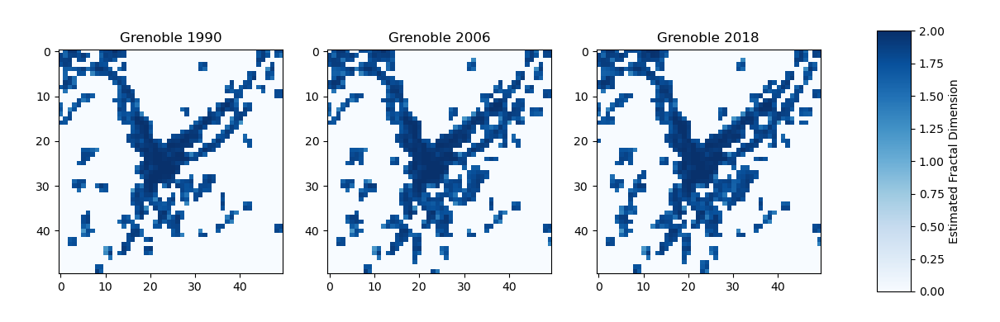
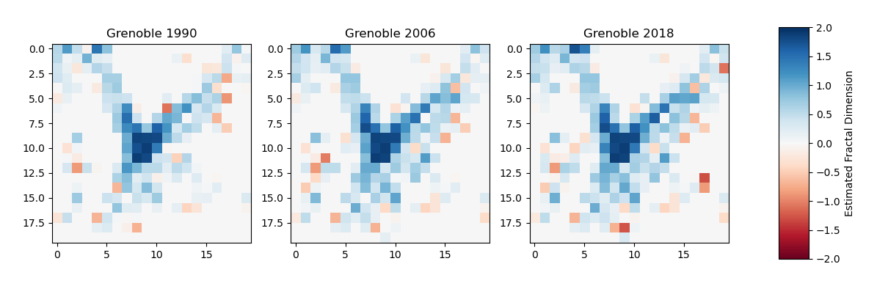
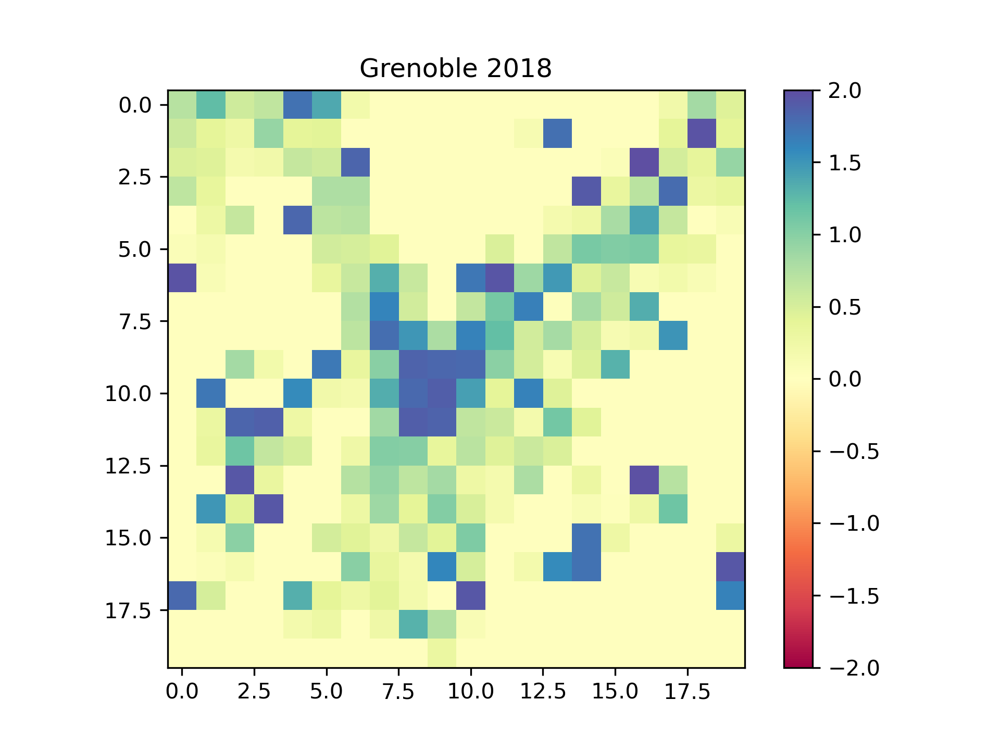
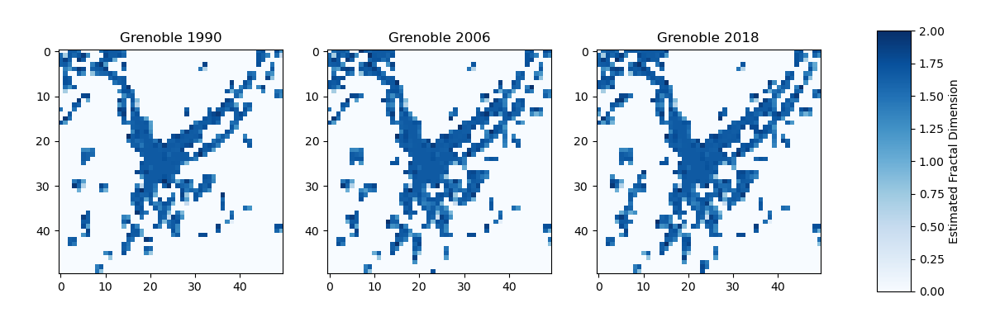

# TIPE - Modélisation Fractale des Villes

Ce TIPE (Travaux d'Initiatives Personnelles encadrées) réalisé durant les années en Classe Préparatoire Scientifique au
lycée Champollion (Grenoble) de 2022 à 2023.

Le thème de cette année était : **la Ville**.

Ce TIPE se place dans le cadre de l'étude des villes et de leur développement à l'aide de modèles mathématiques. La
modélisation choisie ici est celle d'une fractale afin de répondre à la problématique suivante : **_Comment les fractales
peuvent-elles nous renseigner sur l'évolution de nos villes ?_**

## Objectif

L'objectif est ici d'appliquer le modèle mathématique des fractales à une ville (ici Grenoble) et sa périphérie afin 
d'en extraire des informations telles que la dimension de Hausdorff associée (en dimension 2) grâce à la méthode dite 
"*Box Counting Method*" implémentée à l'aide du langage de programmation Python.

Une fois une telle information obtenue, elle sera utilisée pour caractériser la compacité de la ville. Le processus sera
répété à plusieurs reprises mais à des périodes historiques différentes afin d'être capable de commenter l'évolution de
l'indice de compacité au cours du temps, et si possible d'en trouver les raisons socio-économiques.

Une telle étude sera menée à l'aide de cartes d'occupation des sols issues de l'analyse d'image-satellites. Pour des
époques plus anciennes, des cartes historiques seront numériquement traitées afin de les rendre utilisables.

## Résultats

## Démarche

Après avoir divisé la périphérie de Grenoble en 400 carrés de 2.5km de côté, on applique la méthode dite *Box Counting
Method* à chacune d'entre elles afin d'en déduire la dimension fractale (ou de Hausdorff) de chacune. Dans le cas de la
ville de Grenoble en 2018, on obtient la répartition suivante : 

Tout d'abord, on retrouve l'organisation générale de la ville de Grenoble avec son hypercentre (au centre en bleu) où
les bâtiments sont répartis plus densément et sa périphérie en forme d'étoile à trois branches imposée par les montagnes.

Toutefois, on observe des zones de dimensions fractales négatives, ce qui est impossible. Après étude des zones concernées,
on découvre que ce sont des zones quasiment vides, dont la répartition des bâtiments se rapproche du point. Cela devrait 
alors être associé à une dimension fractale proche de 0. 

On pourrait alors songer à simplement forcer l'algorithme à affecter la valeur zéro dans le cas d'une dimension trouvée 
négative. Pourtant, il semble plus intéressant d'affecter le complément à 2 de la dimension trouvée puisque qu'on pourrait
interpréter le résultat trouvé comme la dimension de Hausdorff de l'ensemble formée par les zones sans bâtiments. On 
obtient le résultat suivant :

    

On voit immédiatement que cela ne fonctionne pas : des zones de dimension proche de 2 apparaissent à des endroits vides.
De plus, en appliquant l'algorithme au [Tapis de Sierpiński](https://fr.wikipedia.org/wiki/Tapis_de_Sierpi%C5%84ski), on
obtient une dimension de Hausdorff de 1,60 alors que la dimension avérée est 1,89. Ainsi l'algorithme semble être à remettre
en cause.

On décide alors d'utiliser une version plus simple de l'algorithme Box-Counting, qui semble bien mieux fonctionner :

Toutefois, on observe que les zones denses (l'hyper-centre de Grenoble en particulier) n'ont pas une dimension proche de 2 mais environ 1,5 ce qui n'est pas cohérent.

Pour résoudre ce problème, il est nécessaire d'augmenter artificiellement la taille des subdivisons afin de pouvoir utiliser une plus large gamme de tailles de boîtes. On obtient alors une dimension bien plus cohérente (~ 1,95).

D'autres parts, une clause *try: catch:* a été supprimée dans *fractal_analysis.box_counting* puisqu'elle semblait inutile. Pourtant à l'éxecution suivante, le calcul de log(0) apparait au niveau de la position de la clause supprimée.

Après quelques relectures des fonctions, une erreur est découverte dans *fractal_dimension.is_in* : une réinitialisation de j manquait. En particulier, cela voulait dire que les zones partiellement urbanisées se voyaient assigner une dimension nulle, ce qui ne devait pas être le cas.

Après ces deux corrections majeures, on obtient les résultats suivants :

## Matériel

Ces analyses ont été effectuées en 43min, 47min et 49min respectivement. Le matériel utilisé est le suivant :

* Processeur : Intel Core i5 vPro (2,30GHz)
* RAM : 8GB
* Mémoire : 512GB SSD
* Langage de Programmation : Python 3.9.2

## Source des données utilisées

[CORINE Land Cover](https://land.copernicus.eu/pan-european/corine-land-cover) : Carte d'occupation des sols (1990, 2006, 2018)

## Bibliographie

* Mark McClure : [*Chaos and Fractals*](https://www.marksmath.org/classes/Fall2021ChaosAndFractals/chaos_and_fractals_2021/contents.html) (Section 4) 

* Dierk Schleicher : [*Hausdorff Dimension, its Properties, and its Surprises*](https://arxiv.org/abs/math/0505099)

* Sara Encarnação, Marcos Gaudiano, Francisco C. Santos, José A. Tenedório, & Jorge M Pacheco : [*Fractal Carthography of urban area*](https://www.nature.com/articles/srep00527)

* National Institutes of Health : [*Fractals and Fractal Analysis*](https://imagej.nih.gov/ij/plugins/fraclac/FLHelp/TheoryStartUpScreen.htm) (Section Box Counting)

* Khaled Harrar & Latifa Hamami : [*The box counting method for evaluate the fractal Dimension in radiographic images*](https://www.researchgate.net/publication/254455405_The_Box_Counting_Method_for_Evaluate_the_Fractal_Dimension_in_Radiographic_Images)
