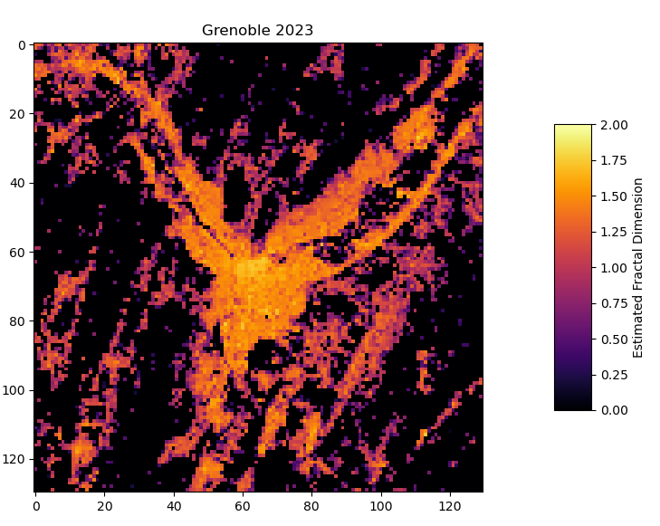

# Fractal Modelisaton of Cities

This TIPE was done during my years in Scientific Preparatory Classes at the Lycée Champollion (Grenoble, France) from 2022 to 2023.

The theme of the year was : **the City**.

>A TIPE ("*Travaux d'Initiatives Personnells encadrées*", literally *Supervised Personal Initiative Work*) is a project lead during the cursus in Preparatory Class for the competitive exams to access to engineering schools.

This TIPE is about the study of cities and their evolution with mathematical models. Here, I modelised the city of Grenoble with fractals, in order to answer the following problematic :

**In what extend do fractals help us to understand the evolution of our cities ?**

# Table of Contents

1. [Objective](#objective)
1. [Usages](#usages)
    1. [Start a Fractal Analysis](#start-a-fractal-analysis)
    1. [Display Former Results](#display-former-results)
1. [Data Source](#data-source)
1. [Result](#result)
1. [Hardware](#hardware)
1. [Bibliography](#bibliography)

## Objective

In this document I will apply the mathematical model of fractal to cities and their outskirts. It will help me to extract pieces of infomations such as the associated *Box-Counting* dimension (a fractal dimension) thanks to the *Box-Counting Method*. We will see that the Fractal Dimensions are an upgraded density of buildings.

For this, I will use the programming language Python.

## Usages

### Start a Fractal Analysis

First, you need a black and white image depicting the location of each builidings of the city you consider (cf [Data Source](#data-source) for France). 

Then the only file `main_script.py` to use it with the function :

``` python
main_script(city, year, resolution, dilatation, src_dir, data_dir, result_dir, used_old_data, show_fig)
```

* `city` : name of the studied city
* `year` : year of the study
* `resolution` : factor of division of the image's side
* `dilatation` : factor of dilatation of the source-image
* `src_dir` : Directory of the source-image
* `data_dir` : Directory where the temporary data will be created
* `result_dir` : Directory where results will be created
* `used_old_data` (default : `False`) : Boolean if old data are already created and can be re-used
* `show_fig` (default : `True`) : Condition if plot is displayed at the end of the analysis

One example : 

``` python
main_script("Grenoble", 2023, 1, 1, "src/grenoble_2023.png", "data", "results")
```

### Display Former Results

`visualization.py` displays old results that are written in a CSV file with the function :

``` python
display(resolution, src, title, nb_raws, cmap_name)
```

* `resolution` : List of the resolution of each result-files
* `src` : List of the directory of each result-files
* `title` : List of titles to display
* `nb_raws` (default : `1`) : Number of raws to display
* `cmap_name` (default : `inferno`) : Name of the theme of the MatPlotLib ColorMap 

For instance :

``` python
display([130], ["results/agglomeration_grenobloise/Grenoble_2023_130x130.csv"], ["Grenoble 2023"])
```

## Data source

* [BD TOPO®](https://geoservices.ign.fr/documentation/donnees/vecteur/bdtopo) : Map of all buildings in Metropolitan France. Created by the IGN ("*Institut Géographique National*", literally *National Geographic Institute*).

## Result

Fractal Analysis of the City of Grenoble and its outskirt in 2023. The surface of each cell is about 6.25ha.

>

## Hardware

* Processor : Intel Core i5 vPro (2,30GHz)
* RAM : 8GB
* Memory : 512GB SSD
* Programming Language : Python 3.9.2

## Bibliography

* Dierk Schleicher : [*Hausdorff Dimension, its Properties, and its Surprises*](https://arxiv.org/abs/math/0505099) (Sections 1 to 4)

* Mark McClure : [*Chaos and Fractals*](https://www.marksmath.org/classes/Fall2021ChaosAndFractals/chaos_and_fractals_2021/contents.html)

* Ivana Konatar, Natasa Popovic & Tomo Popovic : [*Box-Counting Method in Python for Fractal Analysis of Biomedical Images*](https://www.semanticscholar.org/paper/Box-Counting-Method-in-Python-for-Fractal-Analysis-Konatar-Popovic/2d7d5f1e1468a30db49e48969abd8a46da32c20c)

* Khaled Harrar & Latifa Hamami : [*The box counting method for evaluate the fractal Dimension in radiographic images*](https://www.researchgate.net/publication/254455405_The_Box_Counting_Method_for_Evaluate_the_Fractal_Dimension_in_Radiographic_Images)

* Sara Encarnação, Marcos Gaudiano, Francisco C. Santos, José A. Tenedório, & Jorge M Pacheco : [*Fractal Carthography of urban area*](https://www.nature.com/articles/srep00527)
